# Deployment Guide

## Overview

This document describes the deployment architecture, module composition, and security configurations that enable interconnectivity between components in the sports cards infrastructure.

> **Note**: A detailed architecture diagram with all components and environments is available in [DIAGRAM.md](DIAGRAM.md)

## Architecture Diagram

```mermaid
%%{init: {'theme':'base', 'themeVariables': { 'fontSize':'28px', 'fontFamily':'arial'}}}%%
graph LR
    subgraph USERS["👥 Users"]
        Internet[Internet Traffic]
    end
    
    subgraph EAST["🌎 us-east-1 Region PRIMARY"]
        ALB1["⚖️ Application<br/>Load Balancer"]
        
        ECS1["🐳 ECS on EC2<br/>API Services<br/>Auto Scaling"]
        
        WORKERS["⚙️ ECS Workers<br/>Data Sync<br/>Image Processor"]
        
        LAMBDA["⚡ Lambda<br/>Functions<br/>VPC-Integrated"]
        
        RDS1[("💾 RDS PostgreSQL<br/>Multi-AZ<br/>+ 2 Read Replicas")]
        
        SQS1["📬 SQS Queues<br/>+ DLQ"]
        
        CW1["⏰ EventBridge<br/>Schedules"]
        
        IAM1["🔐 IAM<br/>Users & Roles"]
    end
    
    subgraph WEST["🌎 us-west-2 Region DR"]
        ALB2["⚖️ Application<br/>Load Balancer"]
        
        ECS2["🐳 ECS on EC2<br/>API Services<br/>Auto Scaling"]
        
        WORKERS2["⚙️ ECS Workers<br/>Data Sync<br/>Image Processor"]
        
        LAMBDA2["⚡ Lambda<br/>Functions<br/>VPC-Integrated"]
        
        RDS2[("💾 RDS PostgreSQL<br/>Multi-AZ<br/>+ 2 Read Replicas")]
        
        SQS2["📬 SQS Queues<br/>+ DLQ"]
    end
    
    subgraph STATE["📦 State Management"]
        S3_EAST[("S3 Bucket<br/>us-east-1")]
        S3_WEST[("S3 Bucket<br/>us-west-2")]
    end
    
    Internet --> ALB1
    Internet --> ALB2
    
    ALB1 --> ECS1
    ECS1 --> RDS1
    
    LAMBDA --> ECS1
    LAMBDA --> RDS1
    
    WORKERS --> SQS1
    WORKERS --> RDS1
    WORKERS --> ECS1
    
    CW1 --> LAMBDA
    CW1 --> SQS1
    
    RDS1 -."Cross-Region<br/>Replication".-> RDS2
    
    ALB2 --> ECS2
    ECS2 --> RDS2
    
    LAMBDA2 --> ECS2
    LAMBDA2 --> RDS2
    
    WORKERS2 --> SQS2
    WORKERS2 --> RDS2
    WORKERS2 --> ECS2
    
    style RDS1 fill:#ffccff,stroke:#333,stroke-width:4px
    style RDS2 fill:#ffccff,stroke:#333,stroke-width:4px
    style EAST fill:#e6f3ff,stroke:#333,stroke-width:3px
    style WEST fill:#fff4e6,stroke:#333,stroke-width:3px
    style STATE fill:#e6ffe6,stroke:#333,stroke-width:2px
```



### Deployment Coverage

**3 Services**: card-catalog-api • orders-ingestion • manufacturing-orchestrator

**Environments per Service**:
- Dev (us-east-1 only)
- Staging (us-east-1 only)  
- Production (us-east-1 + us-west-2)

**Total**: 12 environment deployments

## Directory Structure

```
sports-cards-infrastructure-terraform/
├── backend-bootstrap/          # Bootstrap S3 + DynamoDB for state storage
├── modules/                    # Reusable Terraform modules
│   ├── ecs-api/               # ECS API service with ALB
│   ├── ecs-worker/            # ECS worker service
│   ├── lambda-microservice/   # Lambda function
│   ├── rds-database/          # RDS PostgreSQL with replicas
│   ├── sqs-queue/             # SQS queue with DLQ
│   ├── cloudwatch-rule/       # EventBridge rule
│   └── iam/                   # IAM users, groups, roles, policies
└── environments/               # Environment-specific configurations
    ├── card-catalog-api/
    │   ├── us-east-1/
    │   │   ├── dev/
    │   │   ├── staging/
    │   │   └── prod/
    │   └── us-west-2/
    │       └── prod/
    ├── orders-ingestion/
    │   └── [same structure]
    └── manufacturing-orchestrator/
        └── [same structure]
```

## Module Architecture

### Module Composition per Environment

Each environment deploys a complete stack by calling multiple modules. For example, `card-catalog-api/us-east-1/prod/main.tf` instantiates:

```
┌─────────────────────────────────────────────────────┐
│  Environment: card-catalog-api/us-east-1/prod      │
├─────────────────────────────────────────────────────┤
│                                                      │
│  ┌────────────────┐  ┌────────────────┐            │
│  │ API Service    │  │ Lambda Functions│            │
│  │ (ecs-api)      │  │ (lambda x2)    │            │
│  └────────────────┘  └────────────────┘            │
│                                                      │
│  ┌────────────────┐  ┌────────────────┐            │
│  │ Workers        │  │ Database       │            │
│  │ (ecs-worker x2)│  │ (rds-database) │            │
│  └────────────────┘  └────────────────┘            │
│                                                      │
│  ┌────────────────┐  ┌────────────────┐            │
│  │ Queues         │  │ Schedules      │            │
│  │ (sqs-queue x1) │  │ (cloudwatch x2)│            │
│  └────────────────┘  └────────────────┘            │
│                                                      │
│  ┌────────────────┐                                 │
│  │ IAM Resources  │                                 │
│  │ (iam)          │                                 │
│  └────────────────┘                                 │
│                                                      │
└─────────────────────────────────────────────────────┘
```

### Module Instantiation Example

```hcl
# API Service Module
module "api_service" {
  source = "../../../../modules/ecs-api"
  
  project_name     = var.project_name
  environment      = var.environment
  aws_region       = var.aws_region
  vpc_id           = var.vpc_id
  subnet_ids       = var.subnet_ids
  
  # Security: Allow Lambda and Workers to access API
  allowed_security_group_ids = [
    module.card_processor_lambda.security_group_id,
    module.user_service_lambda.security_group_id,
    module.data_sync_worker.security_group_id,
    module.image_processor_worker.security_group_id,
  ]
  
  # Auto Scaling Configuration
  asg_min_size         = 2
  asg_max_size         = 10
  asg_desired_capacity = 5
  instance_type        = "t3.medium"
  
  tags = local.common_tags
}

# Lambda Function Module
module "card_processor_lambda" {
  source = "../../../../modules/lambda-microservice"
  
  project_name        = var.project_name
  environment         = var.environment
  service_name        = "card-processor"
  vpc_id              = var.vpc_id
  subnet_ids          = var.subnet_ids
  lambda_package_path = var.card_processor_package_path
  handler             = "index.handler"
  runtime             = "nodejs18.x"
  timeout             = 60
  memory_size         = 1024
  
  tags = local.common_tags
}

# Worker Service Module
module "data_sync_worker" {
  source = "../../../../modules/ecs-worker"
  
  project_name        = var.project_name
  environment         = var.environment
  worker_name         = "data-sync"
  aws_region          = var.aws_region
  vpc_id              = var.vpc_id
  subnet_ids          = var.subnet_ids
  container_image     = var.data_sync_container_image
  
  # Worker has dedicated SQS queue
  create_sqs_queue    = true
  
  # Auto Scaling Configuration
  asg_min_size         = 1
  asg_max_size         = 10
  asg_desired_capacity = 3
  instance_type        = "t3.medium"
  
  tags = local.common_tags
}

# Database Module
module "database" {
  source = "../../../../modules/rds-database"
  
  project_name              = var.project_name
  environment               = var.environment
  vpc_id                    = var.vpc_id
  subnet_ids                = var.subnet_ids
  database_name             = var.db_name
  master_username           = var.db_username
  master_password           = var.db_password
  instance_class            = var.db_instance_class
  
  # Security: Allow API, Lambda, and Workers to access RDS
  allowed_security_groups   = [
    module.api_service.api_security_group_id,
    module.card_processor_lambda.security_group_id,
    module.user_service_lambda.security_group_id,
    module.data_sync_worker.security_group_id,
    module.image_processor_worker.security_group_id,
  ]
  
  # Production: Multi-AZ with replicas
  multi_az                  = true
  create_read_replicas      = true
  read_replica_count        = 2
  
  # Cross-region replication (production only)
  create_cross_region_replica = true
  cross_region_replica_region = "us-west-2"
  
  tags = local.common_tags
  
  providers = {
    aws.replica = aws.replica
  }
}

# IAM Module
module "iam" {
  source = "../../../../modules/iam"
  
  project_name = var.project_name
  environment  = var.environment
  
  # Application Users
  iam_users = {
    app-deployer = {
      policies = [
        "arn:aws:iam::aws:policy/AmazonEC2ContainerRegistryPowerUser",
      ]
    }
    app-reader = {
      policies = [
        "arn:aws:iam::aws:policy/ReadOnlyAccess",
      ]
    }
  }
  
  # Service Roles
  iam_roles = {
    ci-cd-role = {
      assume_role_policy = jsonencode({ ... })
      policies = [
        "arn:aws:iam::aws:policy/AmazonEC2ContainerRegistryPowerUser",
        "arn:aws:iam::aws:policy/AmazonECS_FullAccess",
      ]
    }
  }
  
  tags = local.common_tags
}
```

## Security Group Configuration

### Network Connectivity Matrix

Security groups enable secure communication between components:

```
┌─────────────────────────────────────────────────────────────────┐
│                    Security Group Flow                          │
└─────────────────────────────────────────────────────────────────┘

Internet (0.0.0.0/0)
    │
    │ Port 80
    ▼
┌─────────────────┐
│ ALB Security    │
│ Group           │
└─────────────────┘
    │
    │ Dynamic Ports (32768-65535)
    ▼
┌─────────────────┐        ┌──────────────────┐
│ ECS Instance SG │◄───────│ API Container SG │
└─────────────────┘        └──────────────────┘
                                    │
                                    │ Port 5432
                                    ▼
                           ┌──────────────────┐
                           │ RDS Security     │◄─────┐
                           │ Group            │      │
                           └──────────────────┘      │
                                    ▲                 │
                                    │                 │
                    ┌───────────────┼─────────────────┤
                    │               │                 │
        ┌───────────┴──────┐  ┌────┴───────┐  ┌─────┴──────┐
        │ Lambda Function  │  │ Worker     │  │ Worker     │
        │ Security Group   │  │ SG (Data)  │  │ SG (Image) │
        └──────────────────┘  └────────────┘  └────────────┘
```

### Security Group Rules by Module

#### 1. ECS API Module (`modules/ecs-api/`)

**ALB Security Group:**
```hcl
resource "aws_security_group" "alb" {
  name        = "${var.project_name}-${var.environment}-api-alb-sg"
  description = "Security group for API ALB"
  vpc_id      = var.vpc_id

  # Allow HTTP from internet
  ingress {
    from_port   = 80
    to_port     = 80
    protocol    = "tcp"
    cidr_blocks = ["0.0.0.0/0"]
  }

  # Allow all outbound
  egress {
    from_port   = 0
    to_port     = 0
    protocol    = "-1"
    cidr_blocks = ["0.0.0.0/0"]
  }
}
```

**API Container Security Group:**
```hcl
resource "aws_security_group" "api" {
  name        = "${var.project_name}-${var.environment}-api-sg"
  description = "Security group for API ECS tasks"
  vpc_id      = var.vpc_id

  # Allow traffic from ALB
  ingress {
    from_port       = var.container_port
    to_port         = var.container_port
    protocol        = "tcp"
    security_groups = [aws_security_group.alb.id]
  }

  # Allow all outbound
  egress {
    from_port   = 0
    to_port     = 0
    protocol    = "-1"
    cidr_blocks = ["0.0.0.0/0"]
  }
}

# Dynamic rules for Lambda/Worker access
resource "aws_security_group_rule" "api_ingress_from_allowed" {
  count                    = length(var.allowed_security_group_ids)
  type                     = "ingress"
  from_port                = var.container_port
  to_port                  = var.container_port
  protocol                 = "tcp"
  security_group_id        = aws_security_group.api.id
  source_security_group_id = var.allowed_security_group_ids[count.index]
  description              = "Allow ingress from allowed security group ${count.index}"
}
```

**ECS Instance Security Group:**
```hcl
resource "aws_security_group" "ecs_instance" {
  name        = "${var.project_name}-${var.environment}-api-ecs-instance-sg"
  description = "Security group for ECS EC2 instances"
  vpc_id      = var.vpc_id

  # Allow ALB traffic on dynamic port range
  ingress {
    from_port       = 32768
    to_port         = 65535
    protocol        = "tcp"
    security_groups = [aws_security_group.alb.id]
    description     = "Allow ALB traffic on dynamic ports"
  }

  egress {
    from_port   = 0
    to_port     = 0
    protocol    = "-1"
    cidr_blocks = ["0.0.0.0/0"]
  }
}
```

#### 2. Lambda Module (`modules/lambda-microservice/`)

**Lambda Security Group:**
```hcl
resource "aws_security_group" "lambda" {
  name        = "${var.project_name}-${var.environment}-${var.service_name}-lambda-sg"
  description = "Security group for Lambda function"
  vpc_id      = var.vpc_id

  # Lambda functions typically don't need inbound rules
  # They initiate outbound connections to API, RDS, etc.
  
  egress {
    from_port   = 0
    to_port     = 0
    protocol    = "-1"
    cidr_blocks = ["0.0.0.0/0"]
  }
}
```

**Output for Cross-Module Reference:**
```hcl
output "security_group_id" {
  description = "Security group ID for Lambda function"
  value       = aws_security_group.lambda.id
}
```

#### 3. ECS Worker Module (`modules/ecs-worker/`)

**Worker Security Group:**
```hcl
resource "aws_security_group" "worker" {
  name        = "${var.project_name}-${var.environment}-${var.worker_name}-sg"
  description = "Security group for worker ECS tasks"
  vpc_id      = var.vpc_id

  # Workers typically don't receive inbound traffic
  # They pull from SQS and make outbound connections
  
  egress {
    from_port   = 0
    to_port     = 0
    protocol    = "-1"
    cidr_blocks = ["0.0.0.0/0"]
  }
}
```

**Worker EC2 Instance Security Group:**
```hcl
resource "aws_security_group" "ecs_instance" {
  name        = "${var.project_name}-${var.environment}-${var.worker_name}-ecs-instance-sg"
  description = "Security group for ECS EC2 instances"
  vpc_id      = var.vpc_id

  # No inbound rules needed for workers
  
  egress {
    from_port   = 0
    to_port     = 0
    protocol    = "-1"
    cidr_blocks = ["0.0.0.0/0"]
  }
}
```

#### 4. RDS Database Module (`modules/rds-database/`)

**RDS Security Group:**
```hcl
resource "aws_security_group" "rds" {
  name        = "${var.project_name}-${var.environment}-rds-sg"
  description = "Security group for RDS database"
  vpc_id      = var.vpc_id

  egress {
    from_port   = 0
    to_port     = 0
    protocol    = "-1"
    cidr_blocks = ["0.0.0.0/0"]
  }
}

# Dynamic ingress rules from allowed components
resource "aws_security_group_rule" "rds_ingress" {
  count                    = length(var.allowed_security_groups)
  type                     = "ingress"
  from_port                = 5432
  to_port                  = 5432
  protocol                 = "tcp"
  security_group_id        = aws_security_group.rds.id
  source_security_group_id = var.allowed_security_groups[count.index]
  description              = "Allow PostgreSQL access from allowed security group ${count.index}"
}
```

### Interconnectivity Pattern

The environment configuration wires security groups together:

```hcl
# In environments/card-catalog-api/us-east-1/prod/main.tf

# Step 1: Deploy modules that create security groups
module "api_service" { ... }
module "card_processor_lambda" { ... }
module "user_service_lambda" { ... }
module "data_sync_worker" { ... }
module "image_processor_worker" { ... }

# Step 2: Reference those security groups in dependent modules
module "database" {
  source = "../../../../modules/rds-database"
  
  # RDS accepts connections from these security groups
  allowed_security_groups = [
    module.api_service.api_security_group_id,        # API → RDS
    module.card_processor_lambda.security_group_id,   # Lambda → RDS
    module.user_service_lambda.security_group_id,     # Lambda → RDS
    module.data_sync_worker.security_group_id,        # Worker → RDS
    module.image_processor_worker.security_group_id,  # Worker → RDS
  ]
  
  # ... other config
}

# API service accepts connections from Lambda and Workers
module "api_service" {
  source = "../../../../modules/ecs-api"
  
  allowed_security_group_ids = [
    module.card_processor_lambda.security_group_id,   # Lambda → API
    module.user_service_lambda.security_group_id,     # Lambda → API
    module.data_sync_worker.security_group_id,        # Worker → API
    module.image_processor_worker.security_group_id,  # Worker → API
  ]
  
  # ... other config
}
```

## IAM Configuration

### IAM Module Structure

Each environment deploys IAM resources via the `iam` module:

```hcl
module "iam" {
  source = "../../../../modules/iam"
  
  project_name = var.project_name
  environment  = var.environment
  
  # Application Users
  iam_users = {
    app-deployer = {
      policies = ["arn:aws:iam::aws:policy/AmazonEC2ContainerRegistryPowerUser"]
    }
    app-reader = {
      policies = ["arn:aws:iam::aws:policy/ReadOnlyAccess"]
    }
  }
  
  # Application Groups
  iam_groups = {
    developers = {
      policies = ["arn:aws:iam::aws:policy/PowerUserAccess"]
      members  = ["app-deployer", "app-reader"]
    }
  }
  
  # Service Roles
  iam_roles = {
    ci-cd-role = {
      assume_role_policy = jsonencode({
        Version = "2012-10-17"
        Statement = [{
          Effect = "Allow"
          Principal = { Service = "codebuild.amazonaws.com" }
          Action = "sts:AssumeRole"
        }]
      })
      policies = [
        "arn:aws:iam::aws:policy/AmazonEC2ContainerRegistryPowerUser",
        "arn:aws:iam::aws:policy/AmazonECS_FullAccess",
      ]
    }
  }
  
  # Custom Policies
  custom_policies = {
    s3-data-access = {
      description = "Access to S3 data buckets"
      policy_json = jsonencode({
        Version = "2012-10-17"
        Statement = [{
          Effect = "Allow"
          Action = ["s3:GetObject", "s3:PutObject", "s3:ListBucket"]
          Resource = [
            "arn:aws:s3:::${var.project_name}-${var.environment}-data/*",
            "arn:aws:s3:::${var.project_name}-${var.environment}-data"
          ]
        }]
      })
    }
  }
  
  tags = local.common_tags
}
```

### IAM Roles per Module

Each compute module creates its own IAM roles:

#### ECS API Module IAM Roles

```hcl
# Task Execution Role (pulls images, writes logs)
resource "aws_iam_role" "ecs_execution_role" {
  name = "${var.project_name}-${var.environment}-api-execution-role"
  
  assume_role_policy = jsonencode({
    Version = "2012-10-17"
    Statement = [{
      Action = "sts:AssumeRole"
      Effect = "Allow"
      Principal = { Service = "ecs-tasks.amazonaws.com" }
    }]
  })
}

resource "aws_iam_role_policy_attachment" "ecs_execution_role_policy" {
  role       = aws_iam_role.ecs_execution_role.name
  policy_arn = "arn:aws:iam::aws:policy/service-role/AmazonECSTaskExecutionRolePolicy"
}

# Task Role (application permissions)
resource "aws_iam_role" "ecs_task_role" {
  name = "${var.project_name}-${var.environment}-api-task-role"
  
  assume_role_policy = jsonencode({
    Version = "2012-10-17"
    Statement = [{
      Action = "sts:AssumeRole"
      Effect = "Allow"
      Principal = { Service = "ecs-tasks.amazonaws.com" }
    }]
  })
}

# EC2 Instance Role (for ECS EC2 launch type)
resource "aws_iam_role" "ecs_instance" {
  name = "${var.project_name}-${var.environment}-api-ecs-instance-role"
  
  assume_role_policy = jsonencode({
    Version = "2012-10-17"
    Statement = [{
      Action = "sts:AssumeRole"
      Effect = "Allow"
      Principal = { Service = "ec2.amazonaws.com" }
    }]
  })
}

resource "aws_iam_role_policy_attachment" "ecs_instance" {
  role       = aws_iam_role.ecs_instance.name
  policy_arn = "arn:aws:iam::aws:policy/service-role/AmazonEC2ContainerServiceforEC2Role"
}

resource "aws_iam_instance_profile" "ecs" {
  name = "${var.project_name}-${var.environment}-api-ecs-instance-profile"
  role = aws_iam_role.ecs_instance.name
}
```

#### Lambda Module IAM Roles

```hcl
# Lambda Execution Role
resource "aws_iam_role" "lambda" {
  name = "${var.project_name}-${var.environment}-${var.service_name}-lambda-role"

  assume_role_policy = jsonencode({
    Version = "2012-10-17"
    Statement = [{
      Action = "sts:AssumeRole"
      Effect = "Allow"
      Principal = { Service = "lambda.amazonaws.com" }
    }]
  })
}

# Basic execution permissions
resource "aws_iam_role_policy_attachment" "lambda_basic" {
  role       = aws_iam_role.lambda.name
  policy_arn = "arn:aws:iam::aws:policy/service-role/AWSLambdaBasicExecutionRole"
}

# VPC execution permissions (if VPC-enabled)
resource "aws_iam_role_policy_attachment" "lambda_vpc" {
  count      = var.vpc_id != "" ? 1 : 0
  role       = aws_iam_role.lambda.name
  policy_arn = "arn:aws:iam::aws:policy/service-role/AWSLambdaVPCAccessExecutionRole"
}
```

#### ECS Worker Module IAM Roles

Workers have similar role structure to API, plus optional custom policies:

```hcl
# Task Role with optional custom policy
resource "aws_iam_role" "ecs_task_role" {
  name = "${var.project_name}-${var.environment}-${var.worker_name}-task-role"
  
  assume_role_policy = jsonencode({
    Version = "2012-10-17"
    Statement = [{
      Action = "sts:AssumeRole"
      Effect = "Allow"
      Principal = { Service = "ecs-tasks.amazonaws.com" }
    }]
  })
}

# Custom policy (e.g., SQS access)
resource "aws_iam_role_policy" "worker_custom" {
  count = var.custom_policy_json != "" ? 1 : 0
  name  = "${var.project_name}-${var.environment}-${var.worker_name}-custom-policy"
  role  = aws_iam_role.ecs_task_role.id
  
  policy = var.custom_policy_json
}
```

## Component Communication Flow

### Request Flow Example

1. **External Request → API**
   ```
   Internet → ALB (Port 80) → ECS Instance (Dynamic Port) → API Container (Port 8080)
   ```
   - ALB Security Group allows 0.0.0.0/0:80
   - ECS Instance SG allows ALB SG:32768-65535
   - API Container SG allows ALB SG:8080

2. **API → Database**
   ```
   API Container → RDS (Port 5432)
   ```
   - RDS Security Group allows API Container SG:5432
   - API Task Role has database access permissions

3. **Lambda → API**
   ```
   Lambda Function → API Container (Port 8080)
   ```
   - API Container SG allows Lambda SG:8080 (via `allowed_security_group_ids`)
   - Lambda Execution Role has network access permissions

4. **Lambda → Database**
   ```
   Lambda Function → RDS (Port 5432)
   ```
   - RDS Security Group allows Lambda SG:5432 (via `allowed_security_groups`)
   - Lambda Execution Role has database credentials access

5. **Worker → SQS → Database**
   ```
   EventBridge → SQS → Worker Container → RDS (Port 5432)
   ```
   - Worker Task Role has SQS receive/delete permissions
   - RDS Security Group allows Worker SG:5432
   - Worker Task Role has database access permissions

6. **Worker → API**
   ```
   Worker Container → API Container (Port 8080)
   ```
   - API Container SG allows Worker SG:8080 (via `allowed_security_group_ids`)

## Deployment Steps

### 1. Bootstrap Backend Infrastructure

```bash
cd backend-bootstrap/
terraform init
terraform apply
```

This creates:
- S3 buckets for state storage
- DynamoDB tables for state locking

### 2. Deploy Environment

```bash
cd environments/card-catalog-api/us-east-1/prod/
terraform init
terraform plan
terraform apply
```

The apply process:
1. Creates VPC networking resources (if not existing)
2. Deploys IAM module (users, groups, roles, policies)
3. Deploys Lambda functions with security groups
4. Deploys ECS API with security groups
5. Deploys ECS workers with security groups
6. Wires security groups: API accepts Lambda/Worker traffic
7. Deploys RDS with security group accepting API/Lambda/Worker traffic
8. Deploys SQS queues
9. Deploys EventBridge rules pointing to Lambda/SQS

### 3. Verify Connectivity

Test the security group configuration:

```bash
# From API container
curl http://database-endpoint:5432  # Should connect

# From Lambda function
# Lambda can invoke API via internal ALB DNS or direct container IP

# From worker
# Worker can poll SQS, connect to RDS, and call API
```

## Module Outputs

Each module exports security group IDs and other resources for cross-module reference:

**ECS API Module:**
```hcl
output "api_security_group_id" {
  value = aws_security_group.api.id
}

output "alb_security_group_id" {
  value = aws_security_group.alb.id
}

output "alb_dns_name" {
  value = aws_lb.api.dns_name
}
```

**Lambda Module:**
```hcl
output "security_group_id" {
  value = aws_security_group.lambda.id
}

output "function_arn" {
  value = aws_lambda_function.main.arn
}
```

**Worker Module:**
```hcl
output "security_group_id" {
  value = aws_security_group.worker.id
}

output "queue_arn" {
  value = var.create_sqs_queue ? aws_sqs_queue.worker_queue[0].arn : ""
}
```

**RDS Module:**
```hcl
output "db_endpoint" {
  value = aws_db_instance.main.endpoint
}

output "security_group_id" {
  value = aws_security_group.rds.id
}
```

## Summary

- **Modular Design**: Each environment calls 7 reusable modules
- **Security Groups**: Each module creates its own security groups
- **Cross-Module Wiring**: Environment configs pass security group IDs between modules
- **IAM Roles**: Each compute resource has appropriate IAM roles with least-privilege access
- **Interconnectivity**: Security group rules enable API ← Lambda/Worker and RDS ← API/Lambda/Worker communication
- **Scalability**: Pattern repeats across 12 environments (3 services × 4 environments)
